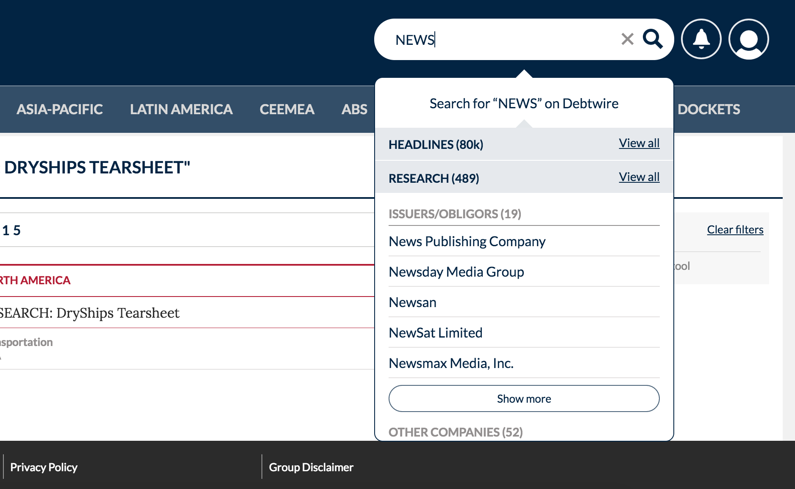

If you are working on a node project there may come a point where your app has a dependency on another custom module you have created.

For example, on my current project, my colleagues and I are responsible for a custom node module called the 'Search Component'. This can be inserted anywhere in the application (usually the header), allowing the user to search the site's content and instantly see a results summary.
 

<small>*Above: The Search Component is a custom node module that can be inserted anywhere in the parent application*</small>
 
Although automated testing has it uses, sometimes manual testing still reigns supreme, particularly when it comes to testing certain interactions and observing user interface changes. 

This was particularly true for me when it came to manually testing changes to our Search Component.

The issue is that simply modifying your module dependency and firing up the app won't allow you to observe those changes.

Luckily, npm has a way to make this happen using the **npm link** command.

#### NPM Link in a nutshell

The [npm documentation](https://docs.npmjs.com/cli/link) defines **npm link** as a *'means to symlink a package folder'*
Put simply, its a means to connect your parent application to a module you have locally on you machine. When you run the application, any changes you make to the dependency will be reflected in the application.

#### How to NPM Link

1. In the terminal, navigate to the folder of the module you want to modify and run the command `npm link`. This makes the module globally available to the rest of your application.

2. Navigate to the folder of the application that depends on the module you want to modify. In the root run the command `npm link [name of module you want to modify]`

3. Finally, you need to run both the parent application and the module dependency. In addition, using a library that watches for changes in your code and rebuilds your app (such as [Nodemon](https://github.com/remy/nodemon)) will be essential in order to save you from restarting the application all the time.

 

